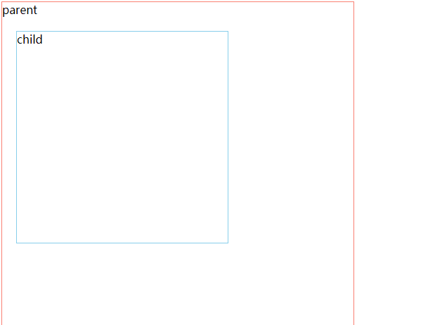
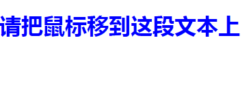

:::tip
  查找HTML元素查找HTML元素
:::

<!-- more -->

## 一、通过 id 查找 HTML 元素
  在 DOM 中查找 HTML  元素的最简单的方法，是通过使用元素的 id
**document.getElementById("id名")**
```
<p id="intro">Hello World!</p>

<script>
var x=document.getElementById("intro");
console.log(x)
</script>
```
输出 ：<p id="intro">Hello World!</p>
**注：如果未找到该元素，则 返回 null。
另外 ，如果有多个id名相同的元素，使用document.getElementById方法，只会返回第一个id名相同的元素，它不会返回数组**

## 二、通过标签名查找 HTML 元素
**document.getElementsByTagName("标签名")**
```
<ul>
    <li>1</li>
</ul>
<script>
    var lis = document.getElementsByTagName("li");
    console.log(lis);
</script>
```
输出 : 


**注意：这是一个数组！！！要想找到这个 li 元素，需要 lis[0]**
## 三、通过类名找到 HTML 元素
**document.getElementsByClassName("类名")**
```
<div class="one">盒子1</div>
<div class="one">盒子2</div>
<script>
    var divs = document.getElementsByTagName("one");
    console.log(divs);
</script>
```
输出：


**注意：返回的也是数组！！！要想找到第一个元素，需要 divs[0]**

:::tip
  改变HTML内容&&样式
:::
## 一、innerHTML
```
<p id="p1">Hello World!</p>
<script>
	document.getElementById("p1").innerHTML="New text!";
</script>
```


上面的段落被一条 JavaScript 脚本修改了
<!-- --- -->
若 innerHTML 里的内容是标签 
```
<p id="p1">Hello World!</p>
<script>
	document.getElementById("p1").innerHTML="<a href='#'>New text!<a>";
</script>
```

它会自动解析HTML标签

 innerHTML 里的内容是空时 既 ：
```
<p id="p1">Hello World!</p>
<script>
   console.log(document.getElementById("p1").innerHTML)
</script>
```


## 二、innerText
它的用法和 innerHTML 相同，唯一区别是 他不可以解析标签，只能解析文本。如：
```
<p id="p1">Hello World!</p>
<script>
	document.getElementById("p1").innerHTML="<a href='#'>New text!<a>";
</script>
```
返回：

并没有解析 a 标签！！！
---
## 三、改变HTML元素的样式
```
<p id="p1">Hello World!</p>
<p id="p2">Hello World!</p>

<script>
    document.getElementById("p2").style.color="blue";
    document.getElementById("p2").style.fontFamily="Arial";
    document.getElementById("p2").style.fontSize="larger";
</script>
```
运行结果：


:::tip
  常见的HTML事件
:::

## 一、onclick 点击事件
```
<div id="one">Hello World!</div>
<script>
  var box = document.getElementById("one")
  box.onclick=function(){
    box.innerHTML="点击了"
    console.log("点击了")
  }
</script>
```


## 二、onfocus && onblur

```
<input type="text" id="txt">
<script>
    var txt =document.getElementById("txt");
    txt.onfocus = function(){ //获取焦点
        this.style.background="pink"
    }
    txt.onblur = function(){ //失去焦点
        this.style.background="skyblue";
    }
</script>
```
>onfocus    获取焦点
onblur  失去焦点
---
## 三、onmouseover && onmouseout


> onmouseover -->鼠标移到某元素之上
> onmouseout -->鼠标从某元素移开

```
<p id="test" class="animated">hello world</p>
<script>
    var test =document.getElementById("test");
    test.onmouseover =function(){ //鼠标移到元素上面之后开始shake
        this.classList.add("shake")
    }
    test.onmouseout =function(){ //鼠标离开后，去除shake动态
        this.classList.remove("shake");
    }
</script>
```
## 四、onchange


> onchange 输入框的内容发生改变时触发

```
<input type="text" id="txt">
<script>
       var txt =document.getElementById("txt");
       txt.onchange=function(){
           this.value="change"  //改变后，框内值变为change
       }
</script>
```
## 五、阻止默认行为


> 阻止默认行为 return false 或 event.preventDefault();

```
<a href="https://www.baidu.com" id="test">hello world</a>
<script>
    var a= document.getElementById("test");
    a.onclick=function(event){
        window.location.href="https://www.sogou.com/";
        event.preventDefault(); //本来是百度，阻止了，成为了搜狗
    }
</script>

```

* * *

## 六、冒泡事件




> 当子元素触发一个事件的时候，倘若父元素也有相同的事件，父元素的事件也会触发

```
 <div id="parent">
        parent
        <div id="child">child</div>
    </div>
<script>
    var parent =document.getElementById("parent");
    var child = document.getElementById("child");
    parent.onclick = function(){
        alert("parent");
    }
    child.onclick =function(event){
        alert("child");
        // 阻止事件冒泡
        event.stopPropagation();
    }
</script>
```
## 七、onresize
当浏览器的窗口大小发生改变的时候触发
>window.innerWidth-->获取浏览器窗口的width
```
<script>
    window.onresize=function(){
    	alert(window.innerWidth)
    }//改变窗口大小，警告框会提示当前宽度
</script>
```
## 八、onmouseover && onmouseout

```
<h1 id="one">请把鼠标移到这段文本上</h1>

<script type="text/javascript">
  var box = document.getElementById("one")
  box.onmouseover=function(){
    box.style.color='red'
  }
  box.onmouseout=function(){
    box.style.color='blue'
  }
</script>

```



